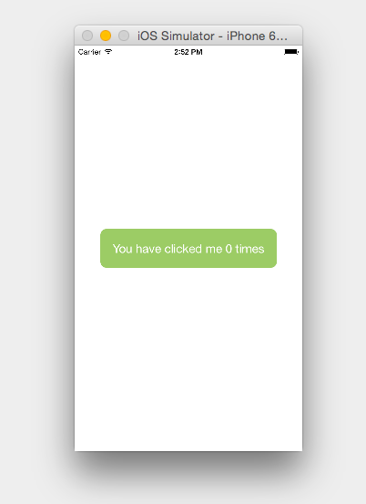
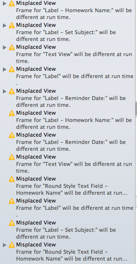
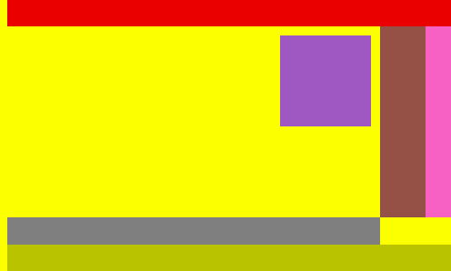

layout: true
class: center

<!--
Xcode open with ClickCounter and BristechApp loaded
Start ClickCount app - with chrome debugging disable, and live reload disabled
Revert any changes to demo projects
Browser open on rnplay.org
-->

---

class: vertical-center

# From jQueryMobile to ReactNative
## A Cross-Platform Journey

Colin Eberhardt / [@ColinEberhardt](https://twitter.com/colineberhardt)<br/>
Scott Logic Ltd.

Bristech, Oct 2015

---

class: vertical-center

# ~~From jQueryMobile to ReactNative~~
## A Cross-Platform Journey

Colin Eberhardt / [@ColinEberhardt](https://twitter.com/colineberhardt)<br/>
Scott Logic Ltd.

Bristech, Oct 2015

---
class: vertical-center

# Geeking out about ReactNative

---
#Cross-platform mobile options

- Native
  - ObjC, Java, Swift, write 'n' times
- Mobile web
  - HTML5
- Hybrid
  - wrapped-HTML5, best (or worst) of both worlds

--
- Native-UI
  - Titanium, Xamarin, NativeScript, ReactNative

---
class: vertical-center

#ReactNative
##... is technically awesome

---
class: vertical-center

#Vanilla-JS

---
class: vertical-center

<div id='jquery-demo' class='click-counter'>
  <button class='counting-button'>
    You have clicked me <span class='click-count'></span> times!
  </button>
</div>

---

```html
<div id='jquery-demo' class='click-counter'>
  <button class='counting-button'>
    You have clicked me <span class='click-count'/> times!
  </button>
</div>
```

```javascript
var button = $('.counting-button');
var clickCountText = $('.click-count');

var numberOfClicks = 0;
var tooManyClicks = false;

function updateUI() {
  clickCountText.text(numberOfClicks);
  button.toggleClass('warning', tooManyClicks);
}

button.click(function() {
  numberOfClicks ++;
  tooManyClicks = numberOfClicks > 5;
  updateUI();
});

updateUI();
```

---

class: image, vertical-center


---
class: vertical-center

#Knockout

---
class: vertical-center

<div id='knockout-demo' class='click-counter'>
  <button data-bind="click: buttonClicked, css: { warning: numberOfClicks() > 5 }">
    You have clicked me <span data-bind="text: numberOfClicks"></span> times!
  </button>
</div>

---

```html
<div id='knockout-demo' class='click-counter'>
  <button data-bind="click: buttonClicked,
                     css: { warning: numberOfClicks() > 5 }">
    You have clicked me
      <span data-bind="text: numberOfClicks"></span> times!
  </button>
</div>
```

```javascript
var ClickCounterViewModel = function() {
  this.numberOfClicks = ko.observable(0);

  this.buttonClicked = function() {
    this.numberOfClicks(this.numberOfClicks() + 1);
  }
}

ko.applyBindings(new ClickCounterViewModel(),
  document.getElementById('knockout-demo'));
```


---
class: image, vertical-center


---

#Knockout

- Logic within the HTML

--
- Clumsy property syntax

--
```javascript
this.numberOfClicks = this.numberOfClicks + 1;
```
--
```javascript
this.numberOfClicks(this.numberOfClicks() + 1);
```
--
- Observable arrays

--
- Templating / binding mini-language

--
- Separation of concerns

--
 - ... really?

---
class: vertical-center

#ReactJS

---
class: vertical-center

<div id='react-demo'></div>

---

```html
<div id='react-demo'></div>
```
```javascript
class ClickCounter extends React.Component {
  constructor() {
    super();
    this.state = { numberOfClicks: 0 };
  }

  buttonClicked() {
    this.setState({ numberOfClicks: this.state.numberOfClicks + 1 });
  }

  render() {
    buttonStyle.backgroundColor =
      this.state.numberOfClicks > 5 ? '#ed5f98' : '#9ccc65';

    return (
      <button onClick={this.buttonClicked.bind(this)} style={buttonStyle}>
        You have clicked me {this.state.numberOfClicks} times
      </button>
    );
  }
}

ReactDOM.render(<ClickCounter />, document.getElementById('react-demo'));
```

---

#ReactJS

- View is a transformation of the current state

--
- Virtual DOM / diff

--
- Separation of concerns (not technologies)

--
- Inline styles are arguably a good thing
  - "CSS in your JS" - [Christopher Chedeau](https://vimeo.com/116209150)

--
- Performance?
 - Is ReactJS Fast? - [Boris Dinkevich](http://blog.500tech.com/is-reactjs-fast/)

---
class: vertical-center, image


---
class: vertical-center, image


<!-- https://sketchboard.me/jzBb9OmZopSV -->


---

class: vertical-center

> If the DOM is decoupled, perhaps it can be replaced?

---

class: image, small-anchor


http://engineering.flipboard.com/2015/02/mobile-web/

---
class: vertical-center

#Getting Started with ReactNative


---

#ReactNative

```bash
$ npm install -g react-native-cli
$ react-native init ClickCounter
```


---

```javascript
class ClickCounterApp extends React.Component {

  constructor(props) {
    super(props);
    this.state = { numberOfClicks: 0 };
  }

  buttonClicked() {
    this.setState({ numberOfClicks: this.state.numberOfClicks + 1 });
  }

  render() {
    buttonColor = this.state.numberOfClicks > 5 ? '#ed5f98' : '#9ccc65';
    buttonStyle.backgroundColor = buttonColor;

    return (
      <View style={containerStyle}>
        <TouchableHighlight underlayColor={buttonColor} style={buttonStyle}
                onPress={this.buttonClicked.bind(this)}>
          <Text style={textStyle}>You have clicked
                me {this.state.numberOfClicks} times</Text>
        </TouchableHighlight>
      </View>
    );
  }
}

AppRegistry.registerComponent('ClickCounter', () => ClickCounterApp);
```

---

class: image, vertical-center



---
class: image

#How does ReactNative work?

<!--- Development server bundles your code
- UIKit virtual DOM
- React runs within JavaScriptCore (virtual DOM, diff, update)
- View updates sent asynchronously to UI thread-->


---

#ReactNative Developer Experience

- Cmd+R to refresh after changes
- Live Reload
- Chrome Dev Tools
- No React component hierarchy :-(
- npm, Babel, web-productivity

---

class: vertical-center

#Layout

---

class: image, vertical-center, small-anchor


http://www.androidauthority.com/android-fragmentation-as-seen-by-the-open-signal-team-250416/

---

class: image, vertical-center, small-anchor


https://developer.apple.com/library/mac/documentation/UserExperience/Conceptual/AutolayoutPG/index.html

---

class: image, vertical-center, small-anchor



http://stackoverflow.com/questions/18919739/warnings-misplaced-view
---

#css-layout - A JavaScript flexbox implementation

```javascript
// create an initial tree of nodes
var nodeTree = {
    "style": {
      "padding": 50
    },
    "children": [
      {
        "style": {
          "padding": 10,
          "alignSelf": "stretch"
        }
      }
    ]
  };

// compute the layout
computeLayout(nodeTree);
```

---

#css-layout - A JavaScript flexbox implementation

```javascript
{
  "style": {
    "padding": 50
  },
  "children": [
    {
      "style": {
        "padding": 10,
        "alignSelf": "stretch"
      },
      "layout": {
        "width": 20,
        "height": 20,
        "top": 50,
        "left": 50,
        "right": 50,
        "bottom": 50,
      }
    }
  ],
  "layout": {
    "width": 120,
    "height": 120,
    "top": 0,
    "left": 0,
    "right": 0,
    "bottom": 0
  }
}
```

---

#css-layout

- Developed using 'extreme' TDD
- Transpiled to Java, C and C#
- With ReactNative, layout runs 'native'


---
#d3fc.io - flexbox for svg

```html
<svg id="chart" style="width: 600px; height: 350px; margin: 10px; background: yellow">
  <g layout-css="height: 30; justifyContent: center; flexDirection: row;"></g>
  <g layout-css="flex: 1; flexDirection: row;">
    <g layout-css="flex: 1; flexDirection: row; justifyContent: flex-end;">
      <g layout-css="width: 100; height: 100; margin: 10"></g>
    </g>
    <g layout-css="width: 50;"></g>
    <g layout-css="width: 30; justifyContent: center;"></g>
  </g>
  ...
</svg>
```

```javascript
d3.select('#chart').layout();
```



---

#ReactNative Conference App
###Interesting things ...

- `NavigatorIOS` - push / pop navigation
- `ListView` - mimics the `UITableView` concept
- `TalkDetails` - mapping over data

---

#There wasn't time for ...

- Animations
- Native component Interface
- Android!
 - Facebook report 85% code shared

---
class: vertical-center

#ReactNative - the good parts

---
class: vertical-center

 > Learn Once, Use Everywhere

---
class: vertical-center

#ReactNative - the bad

---
class: vertical-center


 > All non-trivial abstractions, to some degree, are leaky
 -- [Joel Spolsky](http://www.joelonsoftware.com/articles/LeakyAbstractions.html)

---
#ReactNative - potential leaks

--
 - Bugs in abstraction layer

--
 - 3rd party dependency (iOS 10?)

--
 - Abstraction layers hide features

--
 - Will Facebook still be using ReactNative in 2 years?

---

 #ReactNative - what does it mean to you?

--
 - Native iOS developers - not much? (Swift React)

--
 - Ionic developers - a viable alternative?

--
 - Web developers - much easier route to mobile (no compromises)

--
 - Xamarin developers - Xamarin is more mature, C#, ReactNative more elegant

---

#ReactNative Playground

##rnplay.org


---
class: vertical-center

> ReactNative is an exciting mix of technologies and techniques.
