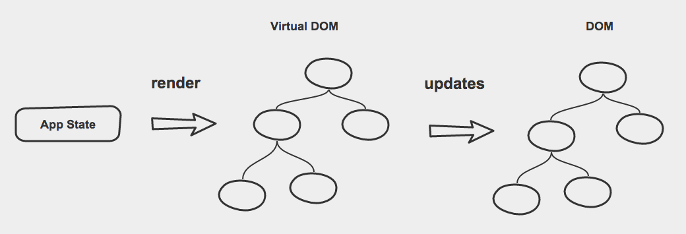
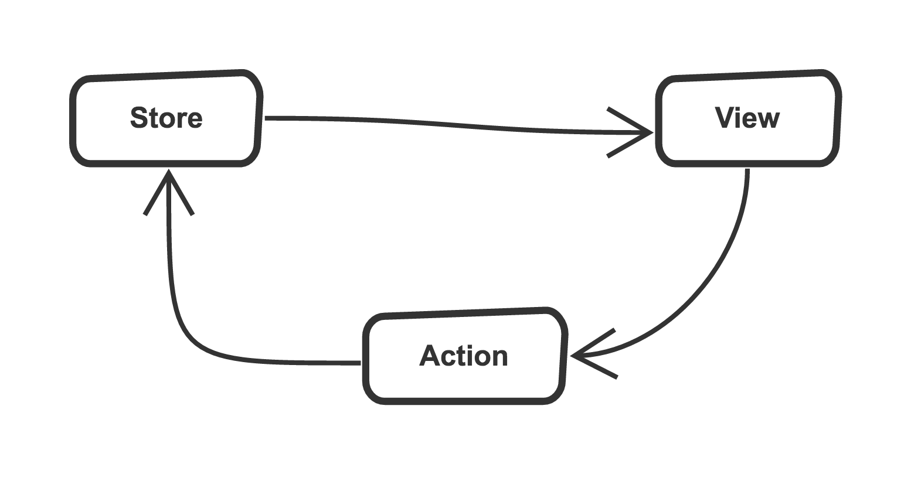

layout: true
class: center, vertical-center
---

class: middle, chapter

# Transforming Development Productivity with Hot-Reload and Time Travel

## @ColinEberhardt / Scott Logic

Broadridge, June 2018

---
class: middle

> any application that **can** be written in JavaScript, **will** eventually be written in JavaScript

Atwood's Law, 2007

<!--
 - it is an amusing twist on the 'principle of least power'
 - a w3c document that proposes using simple langauges, and data formats, over more complex ones
 - Jeff is mocking the simplicity of JavaScript, it is the least powerful language, hence we'll all by JS in the future!
-->

---
class: middle

# My app can be written in JavaScript - but why should I write it in JavaScript?

<!--
 - Nowadays JS runs everywhere, it's a given that you can write in JS
 - but should you?
 - In many cases, whether silverlight, flash, you're been forced to
 - there are good reasons
-->

---
class: middle, chapter

# Developer Productivity

---
class:  image


<!--
 - often quoted book,
 - central theme, adding more dev resource to a late project, simply makes it later
 - I'll leave the big thinking to others, instead I want to focus on something much simpler
-->

---
class:  image


<!--
 - I want to look at the development cycle
 - that think we do over and over again each day
 - the smaller the cycle, the smaller the unit of change, and the faster we become.
-->

---
class: image


compile, link, generate executable, start process ...

---
class:  image


# F5  / ctrl + R / ⌘ + R

---
class:  image


# Single Page Applications

---
class:  image


# minification

---
class:  image


# minification, modules, transpilers

---
class:  image


# ..., linting, polyfills, metrics, ...

---
class:  image


# bootstrapping

---
class: middle

# web builds now rival desktop and mobile in their complexity and duration

---
class: vertical-top

# Mitigation

- Unit tests
- Test harnesses
- Make live changes, then fold back into the code

--
- ☕ ☕ ☕ ☕

---

(demo time)

---
class: vertical-top

# Hot Module Reload

 - Refactor UI into new components
 - Update presentation logic
 - Change formatting logic
 - Update business logic
 - Fix issues with wiring up state to the view

---
class:  image, vertical-center,


---
class:  white, image, vertical-center,


---

class:  white, image, vertical-center,


##  .... the new hotness! ... but what is it?!

---
class: middle

#Vanilla-JS

---
class: middle

<div id='jquery-demo' class='click-counter'>
  <button class='counting-button'>
    You have clicked me <span class='click-count'></span> times!
  </button>
</div>


---

```html
<div id='jquery-demo' class='click-counter'>
  <button class='counting-button'>
    You have clicked me <span class='click-count'/> times!
  </button>
</div>
```


```javascript
var button = $('.counting-button');
var clickCountText = $('.click-count');

// 1. create initial state
var numberOfClicks = 0;
var tooManyClicks = false;

// 2. update UI to reflect current state
function updateUI() {
  clickCountText.text(numberOfClicks);
  button.toggleClass('warning', tooManyClicks);
}

// 3. When clicked, updated state and re-render
button.click(function() {
  numberOfClicks ++;
  tooManyClicks = numberOfClicks > 5;
  updateUI();
});

// 4. initial render
updateUI();
```
---

class: image, vertical-center


---
class: vertical-center

#Knockout

---
class: vertical-center

<div id='knockout-demo' class='click-counter'>
  <button data-bind="click: buttonClicked, css: { warning: numberOfClicks() > 5 }">
    You have clicked me <span data-bind="text: numberOfClicks"></span> times!
  </button>
</div>

---

```html
<div id='knockout-demo' class='click-counter'>
  <button data-bind="click: buttonClicked,
                     css: { warning: numberOfClicks() > 5 }">
    You have clicked me
      <span data-bind="text: numberOfClicks"></span> times!
  </button>
</div>
```

```javascript
var ClickCounterViewModel = function() {
  this.numberOfClicks = ko.observable(0);

  this.buttonClicked = function() {
    this.numberOfClicks(this.numberOfClicks() + 1);
  }
}

ko.applyBindings(new ClickCounterViewModel(),
  document.getElementById('knockout-demo'));
```

---

class: image, vertical-center


---
class: image, vertical-center


---
class: vertical-center

#ReactJS

---
class: vertical-center

<div id='react-demo'></div>

---

```html
<div id='react-demo'></div>
```
```javascript
class ClickCounter extends React.Component {
  constructor() {
    super();
    this.state = { numberOfClicks: 0 };
  }

  buttonClicked() {
    this.setState({ numberOfClicks: this.state.numberOfClicks + 1 });
  }

  render() {
    buttonStyle.backgroundColor =
      this.state.numberOfClicks > 5 ? '#ed5f98' : '#9ccc65';

    return (
      <button onClick={this.buttonClicked.bind(this)} style={buttonStyle}>
        You have clicked me {this.state.numberOfClicks} times
      </button>
    );
  }
}

ReactDOM.render(<ClickCounter />, document.getElementById('react-demo'));
```

---

```html
<div id='react-demo'></div>
```
```javascript
class ClickCounter extends React.Component {
  constructor() {
    super();
    // component state
    this.state = { numberOfClicks: 0 };
  }

  buttonClicked() {
    // component state
    this.setState({ numberOfClicks: this.state.numberOfClicks + 1 });
  }

  render() {
    buttonStyle.backgroundColor =
      this.state.numberOfClicks > 5 ? '#ed5f98' : '#9ccc65';

    return (
      <button onClick={this.buttonClicked.bind(this)} style={buttonStyle}>
        You have clicked me {this.state.numberOfClicks} times
      </button>
    );
  }
}

ReactDOM.render(<ClickCounter />, document.getElementById('react-demo'));
```

---

```html
<div id='react-demo'></div>
```
```javascript
class ClickCounter extends React.Component {
  constructor() {
    super();
    this.state = { numberOfClicks: 0 };
  }

  buttonClicked() {
    this.setState({ numberOfClicks: this.state.numberOfClicks + 1 });
  }

  // render
  render() {
    buttonStyle.backgroundColor =
      this.state.numberOfClicks > 5 ? '#ed5f98' : '#9ccc65';

    return (
      <button onClick={this.buttonClicked.bind(this)} style={buttonStyle}>
        You have clicked me {this.state.numberOfClicks} times
      </button>
    );
  }
}

ReactDOM.render(<ClickCounter />, document.getElementById('react-demo'));
```

---

class: vertical-top

#ReactJS

- ReactJS is 'functional'
 - The view is a pure function of its properties and state
 - The entire view is re-rendered on change

--
- The view is rendered to a virtual DOM
- A 'diffing' process is used to update the real DOM

--
- Separation of concerns (not technologies)

--
- Inline styles are arguably a good thing
  - "CSS in your JS" - [Christopher Chedeau](https://vimeo.com/116209150)

--
- Performance?
 - Is ReactJS Fast? - [Boris Dinkevich](http://blog.500tech.com/is-reactjs-fast/)


---
class: vertical-center, image


---
class: vertical-center, image



---
class: middle

# ReactJS enforces a unidirectional flow of changes
## (which is a good thing)

---
class: middle, chapter

# What's cool about React is the concept, not the implementation

---

# But what about state changes?

(desktop demo time)

---

# Hot Module Reload + Time Travel

- Refactor UI into new components
- Update presentation logic
- Change formatting logic
- Update business logic
- Fix issues with wiring up state to the view
- ...
- If your app reaches an invalid state, back-up
- Replay actions after fixing issues
- Store a log of actions
- And much more ...

---
class:  image, vertical-center,


---
class:  white, image, vertical-center,



---
class:  white, image, vertical-center,

## ... yes ... the store is a singleton

---
class:  middle

# And it works on mobile too!

(mobile demo time)

---
class:  white, image, vertical-center,


---
class: vertical-center, image


---
class:  image, vertical-center,


---

# What has made this possible?

React, Redux, Webpack, TypeScript, VSCode, Electron, ReactNative, Bootstrap, Chrome

---

class: top-left

--
React **(Facebook)**
--
, heavily influenced Angular 2 **(Google)**
--
, WebPack **(Community)**

--
, Redux **(Community)**
--
, adopted by **(Facebook)**
--
, Chrome **(Google)**
--
, a foundation for HTML5 containers **(Electron)**
--
, set the bar for developer tooling
--
, TypeScript **(Microsoft)**
--
, adopted by Angular 2 **(Google)**
--
, Atom **(GitHub)**
--
, foundation of Nuclide (**Facebook**)
--
, built on Electron **(GitHub)**
--
, (foundation for Visual Studio Code **(Microsoft)**)
--
, built on Chromium **(Google)**
--
, ReactNative **(Facebook)**
--
, adopted by **(Microsoft)**
--
, ..., ..., ...

---
class: middle

# My app can be written in JavaScript - but why should I write it in JavaScript?

---
class: middle

## web technologies are being pushed forwards by 100s of enterprises, 1,000s of startups, and 10,000s of individuals

### (in the open)

---
class: middle, chapter

# Transforming Development Productivity with Hot-Reload and Time Travel

## @ColinEberhardt / Scott Logic

Broadridge, June 2018
