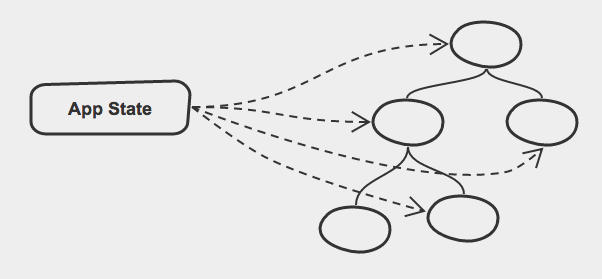

layout: true
class: center

---

class: middle, chapter

# Time Travel And The Future Of HTML5 Productivity

Colin Eberhardt, Scott Logic Ltd. - @ColinEberhardt

May 2016

---
class: middle, chapter

# Scott Logic

--
class: middle

> any application that **can** be written in JavaScript, **will** eventually be written in JavaScript

Atwood's Law, 2007

---
class: middle

# My app can be written in JavaScript - but why should I write it in JavaScript?

---
class: middle, chapter

# Developer Productivity

---
class:  image


---
class:  image


---
class: image


compile, link, generate executable, start process ...

---
class:  image


#F5  / ctrl + R / ⌘ + R

<!-- illustrate this example a bit better -->

---
class:  image


# Single Page Applications

---
class:  image


# minification

---
class:  image


# minification, modules, transpilers

---
class:  image


# ..., linting, polyfills, metrics, ...

---
class:  image


# bootstrapping

---
class: middle

# web builds now rival desktop and mobile in their complexity and duration

---
class: middle

# Mitigation

- Unit tests
- Test harnesses
- Make live changes, then fold back into the code

--
- ☕ ☕ ☕ ☕

---

# Things are getting better

- ReactJS
 - Hot Module Replacement
- Redux
 - Time Travel

---
class: middle, chapter

# ReactJS - What is it?
## (and how does it work?)

---
class: middle

#Vanilla-JS

---
class: middle

<div id='jquery-demo' class='click-counter'>
  <button class='counting-button'>
    You have clicked me <span class='click-count'></span> times!
  </button>
</div>


---

```html
<div id='jquery-demo' class='click-counter'>
  <button class='counting-button'>
    You have clicked me <span class='click-count'/> times!
  </button>
</div>
```


```javascript
var button = $('.counting-button');
var clickCountText = $('.click-count');

// 1. create initial state
var numberOfClicks = 0;
var tooManyClicks = false;

// 2. update UI to reflect current state
function updateUI() {
  clickCountText.text(numberOfClicks);
  button.toggleClass('warning', tooManyClicks);
}

// 3. When clicked, updated state and re-render
button.click(function() {
  numberOfClicks ++;
  tooManyClicks = numberOfClicks > 5;
  updateUI();
});

// 4. initial render
updateUI();
```
---

class: image, vertical-center


---
class: vertical-center

#Knockout

---
class: vertical-center

<div id='knockout-demo' class='click-counter'>
  <button data-bind="click: buttonClicked, css: { warning: numberOfClicks() > 5 }">
    You have clicked me <span data-bind="text: numberOfClicks"></span> times!
  </button>
</div>

---

```html
<div id='knockout-demo' class='click-counter'>
  <button data-bind="click: buttonClicked,
                     css: { warning: numberOfClicks() > 5 }">
    You have clicked me
      <span data-bind="text: numberOfClicks"></span> times!
  </button>
</div>
```

```javascript
var ClickCounterViewModel = function() {
  this.numberOfClicks = ko.observable(0);

  this.buttonClicked = function() {
    this.numberOfClicks(this.numberOfClicks() + 1);
  }
}

ko.applyBindings(new ClickCounterViewModel(),
  document.getElementById('knockout-demo'));
```

---

class: image, vertical-center


---
class: image, vertical-center


---

#Knockout


- Uses an 'observables' concept

--
- Templating / binding mini-language

--
- Separation of concerns

--
 - ... really?

---
class: vertical-center

#ReactJS

---
class: vertical-center

<div id='react-demo'></div>

---

```html
<div id='react-demo'></div>
```
```javascript
class ClickCounter extends React.Component {
  constructor() {
    super();
    this.state = { numberOfClicks: 0 };
  }

  buttonClicked() {
    this.setState({ numberOfClicks: this.state.numberOfClicks + 1 });
  }

  render() {
    buttonStyle.backgroundColor =
      this.state.numberOfClicks > 5 ? '#ed5f98' : '#9ccc65';

    return (
      <button onClick={this.buttonClicked.bind(this)} style={buttonStyle}>
        You have clicked me {this.state.numberOfClicks} times
      </button>
    );
  }
}

ReactDOM.render(<ClickCounter />, document.getElementById('react-demo'));
```

---

```html
<div id='react-demo'></div>
```
```javascript
class ClickCounter extends React.Component {
  constructor() {
    super();
    // component state
    this.state = { numberOfClicks: 0 };
  }

  buttonClicked() {
    // component state
    this.setState({ numberOfClicks: this.state.numberOfClicks + 1 });
  }

  render() {
    buttonStyle.backgroundColor =
      this.state.numberOfClicks > 5 ? '#ed5f98' : '#9ccc65';

    return (
      <button onClick={this.buttonClicked.bind(this)} style={buttonStyle}>
        You have clicked me {this.state.numberOfClicks} times
      </button>
    );
  }
}

ReactDOM.render(<ClickCounter />, document.getElementById('react-demo'));
```

---

```html
<div id='react-demo'></div>
```
```javascript
class ClickCounter extends React.Component {
  constructor() {
    super();
    this.state = { numberOfClicks: 0 };
  }

  buttonClicked() {
    this.setState({ numberOfClicks: this.state.numberOfClicks + 1 });
  }

  // render
  render() {
    buttonStyle.backgroundColor =
      this.state.numberOfClicks > 5 ? '#ed5f98' : '#9ccc65';

    return (
      <button onClick={this.buttonClicked.bind(this)} style={buttonStyle}>
        You have clicked me {this.state.numberOfClicks} times
      </button>
    );
  }
}

ReactDOM.render(<ClickCounter />, document.getElementById('react-demo'));
```

---

#ReactJS

- ReactJS is 'functional'
 - The view is a pure function of its properties and state
 - The entire view is re-rendered on change

--
- The view is rendered to a virtual DOM
- A 'diffing' process is used to update the real DOM

--
- Separation of concerns (not technologies)

--
- Inline styles are arguably a good thing
  - "CSS in your JS" - [Christopher Chedeau](https://vimeo.com/116209150)

--
- Performance?
 - Is ReactJS Fast? - [Boris Dinkevich](http://blog.500tech.com/is-reactjs-fast/)

---
class: vertical-center, image



---
class: vertical-center, image


<!-- https://sketchboard.me/jzBb9OmZopSV -->

---
class: middle

# ReactJS enforces a unidirectional flow of changes
## (which is a good thing)

---
class: middle, chapter

# What's cool about React is the concept, not the implementation


---
class: middle

# But what about developer productivity??!!

---
class:  image, vertical-center,


---
class:  white, image, vertical-center,


---

# Hmmm ....

- ReactJS
 - Application state and the view are decoupled
 - The view and the DOM are decoupled

--
- Webpack
 - Hot swap modules

--
- So can we hot-swap the view?  😍😍😍

--
- (demo time)

---

# Hot Module Reload

- You can update your code, and see the effect almost immediately
 - Refactor UI into new components
 - Update presentation logic
 - Change formatting logic
 - Update business logic
 - Fix issues with wiring up state to the view

--
- But what about state changes?

---
class:  image, vertical-center, white

# Redux


---
class:  middle

(state, action) => state

---
class:  middle

(desktop demo time)

<!--
Perform a few actions on the order
re-wind then fix the loading screen
-->

---

# Time Travel

- Rewind and replay actions
 - If your app reaches an invalid state, back-up
- When combined with Hot Module Reload ...
 - Awesome things become possible

---
class:  middle

# And it works on mobile too!

---

class: middle, chapter

# Conclusions

---
class: middle

# HTML5 has considerable momentum
### due to the combined efforts of enterprises, startups, and individuals

---
class: middle

# Embrace new technologies
### (but be wary of those that are just re-hashes of old ideas!)

---
class: middle

# Learn once, use everywhere
