class: center, middle, chapter

# Cross Platform Mobile
## Looking Beyond The HTML5 Hype

Colin Eberhardt, Scott Logic Ltd. - [@ColinEberhardt](https://twitter.com/colineberhardt)

HSBC London, April 2015

---
# Overview

- Why mobile? and why cross platform?
- The solution? ... HTML5!
- Native vs. Hybrid vs. Web-app
- Native vs. Native-UI vs. Web-UI
- Selecting a suitable development approach
- PropertyCross
- Questions? (still awake?)

---
# Geek points
This presentation was written in markdown and rendered using [remark](https://github.com/gnab/remark/), with the presentation [sourcecode available on GitHub](https://github.com/ColinEberhardt/CrossPlatformMobilePresentation).

```markdown
# Cross Platform Mobile
## looking beyond the HTML5 Hype

Colin Eberhardt - [@ColinEberhardt](https://twitter.com/colineberhardt)
---

class: center, middle

# Why Mobile?

---

class: center, middle

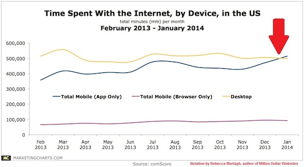

Early 2014, [mobile web traffic exceeded desktop](http://searchenginewatch.com/sew/opinion/2353616/mobile-now-exceeds-pc-the-biggest-shift-since-the-internet-began)
```

---
class: center, middle, chapter
# Why Mobile?

---
class: center, middle
.section-title[Why Mobile?]


#2010

---
class: center, middle
.section-title[Why Mobile?]


Early 2014, [mobile web traffic exceeded desktop](http://searchenginewatch.com/sew/opinion/2353616/mobile-now-exceeds-pc-the-biggest-shift-since-the-internet-began)

---
class: center, middle
.section-title[Why Mobile?]


Late 2014 [the Guardian reported](http://www.theguardian.com/business/2014/sep/02/online-shopping-mobiles-overtakes-desktop) that for online shopping, 52% of visits were from mobile devices, resulting in 36% of transactions.

---
class: center, middle
.section-title[Why Mobile?]


Apple's App Store economy has [reached $10bn - bigger than Hollywood!](http://fortune.com/2015/01/22/apples-apps-economy-bigger-than-hollywood/)

---
class: center, middle
.section-title[Why Mobile?]

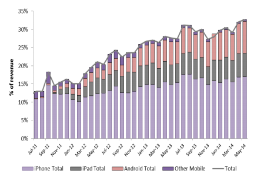

IG Group reported over [30% of their revenues coming from mobile devices](http://www.google.com/url?q=http%3A%2F%2Fforexmagnates.com%2Fcloser-look-at-ig-group-fy-2014-results-mobile-and-equities-up-forex-down%2F&sa=D&sntz=1&usg=AFQjCNHDSFzCv6aYg7NteFWaFX_YAacu1w) by mid-2014

---
class: center, middle
.section-title[Why Mobile?]

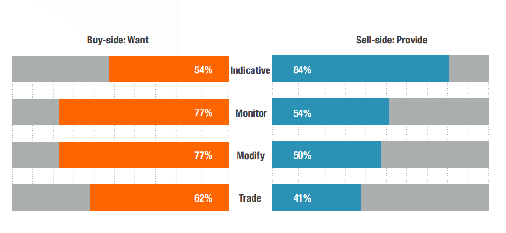

A Caplin study revealed that there was a [significant gap between features supplied and demand](https://www.caplin.com/business/news-post/trading-on-the-move).

---
.section-title[Why Mobile?]
# Can You Run A Business Entirely From A Mobile Phone?

- 90% of execs use mobiles around the office
- 10% as their primary device

via [Joe McKendrick, Forbes](http://www.forbes.com/sites/joemckendrick/2014/11/24/can-you-run-a-business-entirely-from-a-mobile-phone/)

---
class: center, middle, chapter
# Why Cross Platform?

---
class: center, middle
.section-title[Why Cross Platform?]

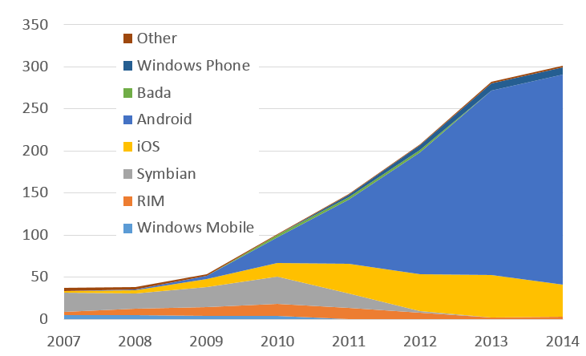

Worldwide smartphone sales (millions) as reported [by Gartner](http://en.wikipedia.org/wiki/Mobile_operating_system)

---
class: center, middle
.section-title[Why Cross Platform?]


Gartner's 2011 prediction that [Windows Phone would 'beat' iOS by 2015](http://blog.scottlogic.com/2011/04/08/gartner-predicts-a-promising-future-for-windows-phone-7-developers.html), didn't quite work out.

---
class: center, middle
.section-title[Why Cross Platform?]

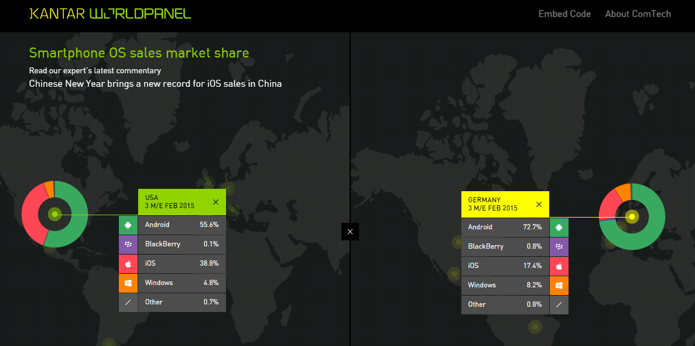

There are significant regional variations - via [Kantar WorldPanel](http://www.kantarworldpanel.com/smartphone-os-market-share/)

---
.section-title[Why Cross Platform?]
#Implementation Technologies

- iOS - Objective-C / Swift
- Android - Java
- Windows Phone - C#
- BlackBerry - Java


### 4x development cost
If only there was another way? ...

---
class: center, middle, chapter
#HTML5 to the Rescue!


---
class: center, middle
.section-title[HTML5]
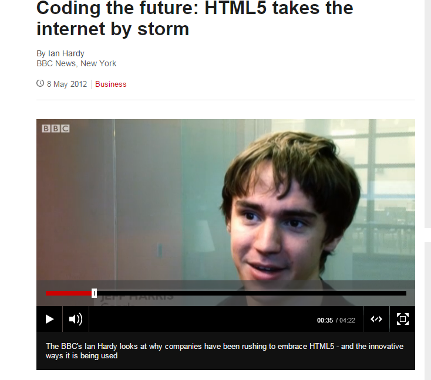

[BBC News, 2012](http://www.bbc.co.uk/news/business-17931814)

---
class: center, middle
.section-title[HTML5]
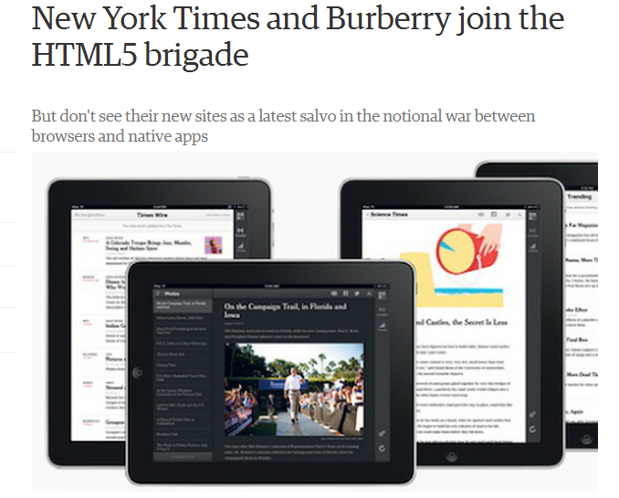

[Guardian, 2012](http://www.theguardian.com/technology/appsblog/2012/oct/03/html5-apps)

---
class: center, middle
.section-title[HTML5]


"Finally HTML5 matches and beats native" - Steve Newcomb

---
class: center, middle
.section-title[HTML5]


"The biggest mistake we made as a company was betting too much on HTML5 as opposed to native" - Mark Zuckerberg

---
class: center, middle
.section-title[HTML5]
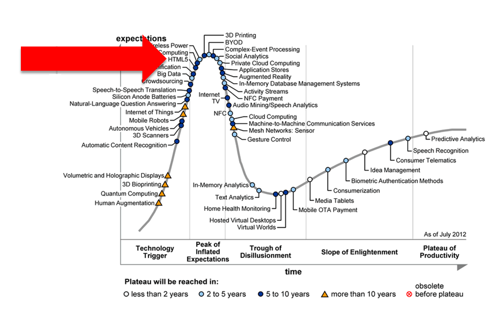

Gartner's 2012 Hype Cycle for Emerging Technologies 

---
class: center, middle
.section-title[HTML5]


---
class: center, middle
.section-title[HTML5]


---
class: center, middle
.section-title[HTML5]


---
class: center, middle, chapter
#What is HTML5?

---
.section-title[What is HTML5?]
#A (huge) collection of specifications

- Canvas and video tags
- Local storage
- Web Workers 
- Web Sockets 
- CSS3 
 - layout, flexbox
 - gradients
 - rounded corners, drop shadows and animations!

---
.section-title[What is HTML5?]
#And more ...

- ES6, modules, arrow functions, ...
- Device orientation
- Media capture / Camera
- Geolocation
- Bluetooth

---
.section-title[What is HTML5?]
#What is HTML5?

- A universal acceptance that browsers *will* host apps
- A standard process to ensure that those apps
 - *Will* be easier to write
 - *Will* have access to more functionality

---
class: center, middle, chapter
#HTML5 for Mobile

---
class: center, middle
.section-title[HTML5 for Mobile]
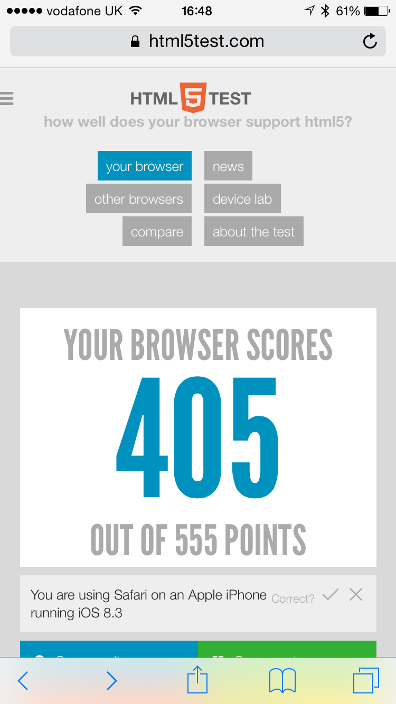

---
class: center, middle
.section-title[HTML5 for Mobile]


---
.section-title[HTML5 for Mobile]
#Native vs. Web-app vs. Hybrid

--

- Native
 - Implement the same app multiple times

--
- Web-app
 - Some phone features not accessible
 - App-like experience is possible (but not via app-store)

--
- Hybrid
 - Content rendered within a browser control
 - Distributed through app-stores / marketplaces
 - Best (or worst) of both worlds

---
class: center, middle
.section-title[HTML5 for Mobile]
#Hybrid apps

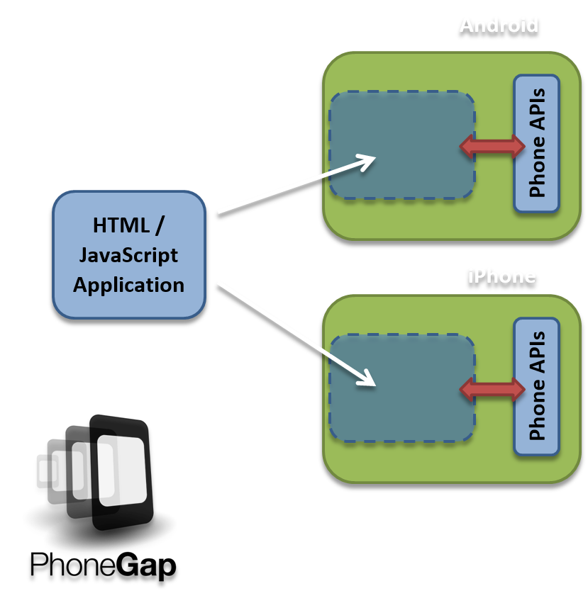

---
class: center, middle, chapter
#The state of HTML5

---
class: center, middle
.section-title[The state of HTML5]
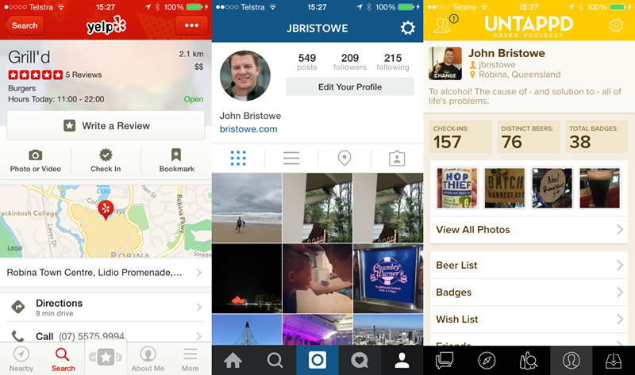

---
class: center, middle
.section-title[The state of HTML5]
<iframe width="640" height="360" src="https://www.youtube.com/embed/hHk1ENkwWq8" frameborder="0" allowfullscreen></iframe>

---
class: center, middle
.section-title[HTML5 for Mobile]


42% are using HTML5 - 15% are targeting mobile browsers - [Developer Economics 2014 Q3](http://www.visionmobile.com/product/developer-economics-q3-2014/)

---
class: center, middle, chapter
#HTML5 is a terrible hack!

---
class: center, middle
.section-title[HTML5 is a terrible hack!]
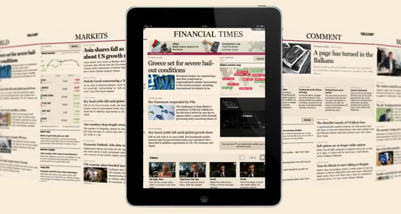

The FT app developers created [FastClick](http://labs.ft.com/articles/ft-fastclick/)

---
class: center, middle
.section-title[HTML5 is a terrible hack!]

<iframe width="400" height="300" src="http://lab.cubiq.org/iscroll/examples/simple/"></iframe>

Scrolling requires a *lot* of code!

---
class: center, middle
.section-title[HTML5 is a terrible hack!]


[Flipboard](http://engineering.flipboard.com/2015/02/mobile-web/) - in pursuit of 60fps.

---
class: center, middle, chapter
#You need frameworks!

---
class: center, middle
.section-title[mobile frameworks]
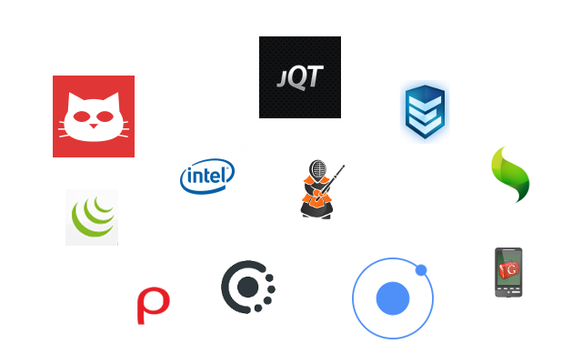

There are many many frameworks

---
class: center, middle
.section-title[mobile frameworks]
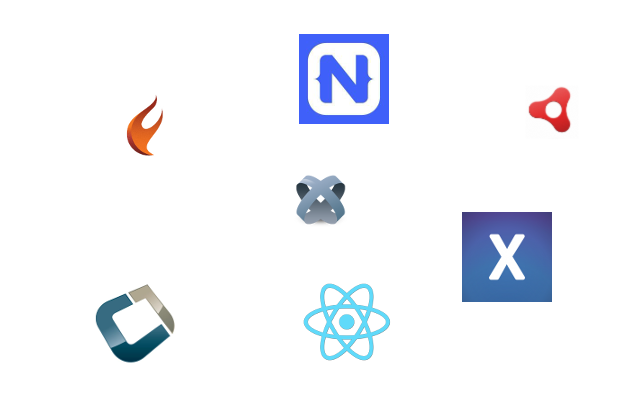

But why restrict yourself just to HTML5?

---
class: center, middle
.section-title[mobile frameworks]
#Hybrid, Native, Web-app isn't enough

---
.section-title[mobile frameworks]
#A user-experience classification

--
- Native

--
- Native-UI
 - Transpilers, Virtual Machines, etc ...

--
- Web-UI
 - HTML5

---
class: center, middle, chapter
#Selecting a Framework

---
.section-title[mobile frameworks]
#Framework Selection

- Usual principles
 - Cost, Maturity, Support, ...

--
- What is the end-user experience?

--
- What is the developer experience?

--
- How much code is shared?

--
- Which plaforms are supported?

--
- Now start testing!

---
class: center, middle


(inspired by ToDoMVC)

---
.section-title[PropertyCross]
#PropertyCross

- A realistic application
- Creates apps that are ready for app-store distribution
- Matches the platform look and feel
- Well designed / structured

---
class: center, middle
.section-title[PropertyCross]
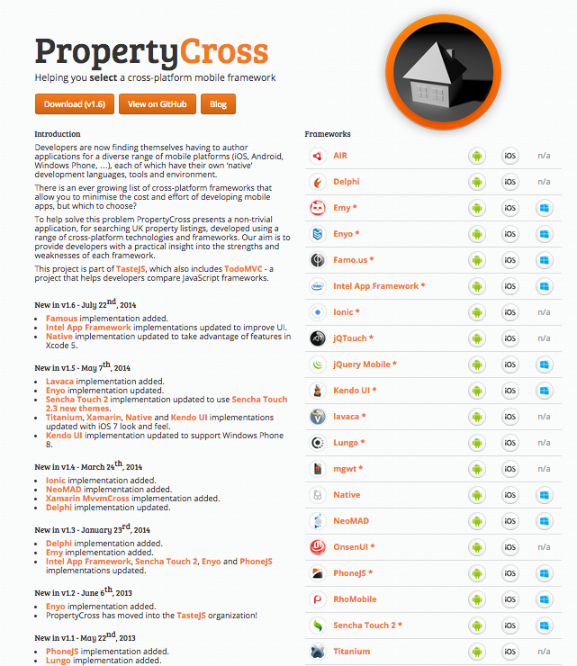

22 frameworks, 57 apps

---
class: center, middle
.section-title[PropertyCross]
#Native

<iframe width="640" height="360" src="https://www.youtube.com/embed/RJXtfk43SCM" frameborder="0" allowfullscreen></iframe>

---
.section-title[PropertyCross]
#jQueryMobile

- Created by the jQuery team
- Designed to make it very easy to create native-like interfaces
- PhoneGap wrapped - using the cloud!
- Intended more for static websites than apps
- 99% shared code
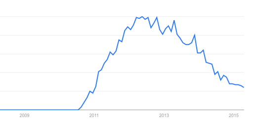

---
class: center, middle
.section-title[PropertyCross]
#jQueryMobile

<iframe width="640" height="360" src="https://www.youtube.com/embed/h0TVvKPLBR4" frameborder="0" allowfullscreen></iframe>

---
class: center, middle
.section-title[PropertyCross]
#Native Transitions

<iframe width="640" height="360" src="https://www.youtube.com/embed/rrkG4swoNAE" frameborder="0" allowfullscreen></iframe>

---
class: center, middle
.section-title[PropertyCross]
#jQueryMobile Transitions

<iframe width="640" height="360" src="https://www.youtube.com/embed/lSKLtyZ2vfc" frameborder="0" allowfullscreen></iframe>

---
.section-title[PropertyCross]
#jQueryMobile Thoughts

- An old approach to mobile
- Primarily intended for websites
- Still used by Intel XDK, RhoMobile and others

---
.section-title[PropertyCross]
#Sencha Touch

- A commercial framework, created by the company behind Ext-JS
- Improved transitions and UI
- A 'thick' abstraction layer
- 100% shared code

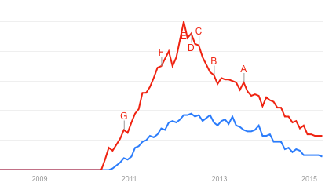

---
.section-title[PropertyCross]
class: center, middle
#Sencha Touch

<iframe width="640" height="360" src="https://www.youtube.com/embed/w2sJ84-qtl4" frameborder="0" allowfullscreen></iframe>

---
.section-title[PropertyCross]
#Ionic

- Built on standard tools - SaSS, AngularJS, npm
- A simpler approach, more akin to iOS 7 / material
- Ionic 'view' app
- 100% shared code
- Windows Phone 'on roadmap'

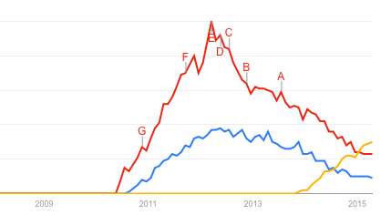

---
class: center, middle
.section-title[PropertyCross]
#Ionic

<iframe width="640" height="360" src="https://www.youtube.com/embed/K6lItgiK1F4" frameborder="0" allowfullscreen></iframe>

(Phone demo, PropertyCross, ChefSteps, HTML5 Trader)


---
.section-title[PropertyCross]
#Ionic Thoughts

- A relatively simple HTML5 framework
- 'graded' mobile platforms for degradation
- Modern tooling
- Creating a slick UI is [still a challenge](http://blog.scottlogic.com/2014/12/12/html5-android-optimisation.html)
 - Battling for 60fps, remove DOM updates, 16ms computation 'window'

---
.section-title[PropertyCross]
#Titanium

- A commercial framework from Appcelerator
- Code runs within a JavaScript Interpreter
- Renders a native UI
- Very 'thick' abstraction layer and complex tooling
- 90% code shared

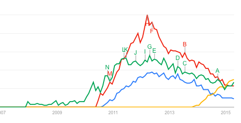

---
.section-title[PropertyCross]
#Titanium Thoughts

- A complex abstraction
 - The thicker the abstraction, the greater the risk
 - Harder to debug, more reliance on a third-party, more bugs
- Works well for simple applications
- Popularity is dwindling


---
.section-title[PropertyCross]
#Xamarin

- A commercial framework from Xamarin
- Allows you to write iOS and Android apps using C# / .NET
- Strong connection with Microsoft
- Well funded

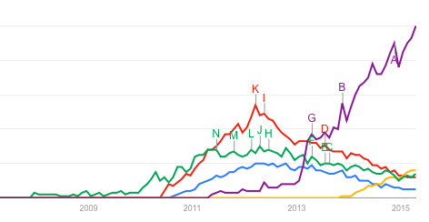

---
class: center, middle
.section-title[PropertyCross]
#Xamarin

<iframe width="640" height="360" src="https://www.youtube.com/embed/MRhAQVWS7FY" frameborder="0" allowfullscreen></iframe>

---
.section-title[PropertyCross]
#Xamarin Thoughts

- A thinner abstraction, yet still one you rely on
 - Xamarin has same-day releases for iOS OS updates
- Only 45% code shared!
 - Increases to 55% with MvvmCross
 - In practice, this will vary

---
.section-title[PropertyCross]
#React Native

- Facebook is back!
- A novel approach, based on ReactJS
- JavaScriptCore in a background thread, rendering to a native UI
- Used for the Facebook *'something or other'* app

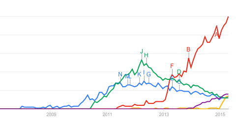

---
class: center, middle
.section-title[PropertyCross]
#React Native


(demo - https://youtu.be/gsyoqce6ygk)


---
.section-title[PropertyCross]
#React Native Thoughts

- iOS only, Android on its way
- Fascinating from a developer perspective
- For commercial use? Certainly not ready yet!

---
class: center, middle
.section-title[PropertyCross]
#And the rest ...

### Lavaca, Lungo,
### Emy, Codename One, Adobe Air,
### Delphi, Famo.us, Intel XDK
### mgwt, NeoMAD, OnsenUI,
### PhoneJS, RhoMobile, jQTouch, Kendo UI

---
class: center, middle, chapter
.section-title[PropertyCross]
#Conclusions

---
.section-title[PropertyCross]
#Conclusions - 1

- There is no single correct choice
- Every option is a compromise
- It is about finding which compromise is right for you

---
.section-title[PropertyCross]
#Conclusions - 2

- Prototype your application early, and get feedback from users
- Determine whether you need a native-UI
- Choose a native-UI or web-UI framework
 - Research, Test, use PropertyCross
- Avoid 'thick' abstractions

---
.section-title[PropertyCross]
#Conclusions - 3

- Don't wait for technology convergence!

---
class: center, middle, chapter

# Cross Platform Mobile
## Looking Beyond The HTML5 Hype

Colin Eberhardt - [@ColinEberhardt](https://twitter.com/colineberhardt)