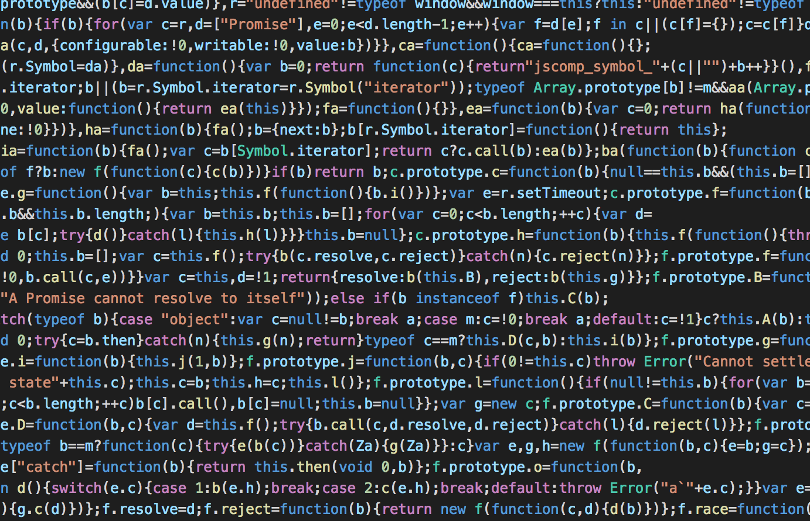
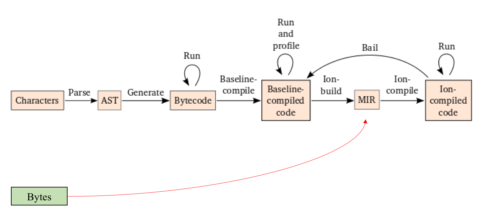

layout: true

---
class: center, middle, chapter

# WebAssembly
## and the future of JavaScript
• • •
## @ColinEberhardt, Scott Logic

---
class: center, middle, chapter

# A brief history of the web

---
class: center, middle

# JavaScript
## (created in 10 days in May 1995, by Brendan Eich)

---
class: center, middle

# Java Applets

---
class: center, middle

# ActiveX

---
class: center, middle

# Flash

---
class: center, middle

# Silverlight

---
class: center, middle

# Dart

---
class: center, middle

# 2018 - JavaScript (still!)

--
## ... but the way we are using it has changed

---
class: image, middle

JavaScript is the Assembly Language of the Web

---
class: center, middle

# JavaScript isn't a very good Assembly Language!

---
class: image, middle

https://blog.mozilla.org/luke/2014/01/14/asm-js-aot-compilation-and-startup-performance/

---
class: image, middle

What does JavaScript execution look like today?

https://hacks.mozilla.org/2017/02/a-cartoon-intro-to-webassembly/

---
class: center, middle

> the Web has become the most ubiquitous application platform ever, and yet by historical accident the only natively supported programming language for that platform is JavaScript!

---
class: center, middle, chapter

# WebAssembly

> WebAssembly or wasm is a new portable, size- and load-time-efficient format suitable for compilation to the web.

---
class: image, middle

optimised execution

---
class: center, offtop, image

# WebAssembly Roadmap

- 2015 - WebAssembly Community Group formed
- 2017 - WebAssembly MVP released
- 2018 - W3C public draft published

 
 

---
class: image, middle

---
class: center, offtop

# WebAssembly Architecture

- A stack machine, 4 types, 67 instructions
- Designed to support streaming compilation
- Simple validation rules
- Exports / imports functions
- Linear memory is shared with JavaScript

---
class: center, offtop

# WebAssembly Future

- Garbage collector
- Threads
- Host bindings
- SIMD
- Exception handling

---
class: center, middle, chapter

# WebAssembly Language Support
## (and what people are doing with it)

---
class: center, middle, chapter

# C / C++

---
class: image

https://pspdfkit.com/blog/2017/webassembly-a-new-hope/

---
class: image

https://mbbill.github.io/JSC.js/

---
class: image

---
class: center, middle, chapter

# Java / C&#35;

---

class: image

---
class: center, middle, chapter

# JavaScript

---
class: image

https://bl.ocks.org/ColinEberhardt/6ceb7ca74aabac9c8534d7120d31b382

---
class: center, offtop

~~~javascript
simulation = d3.forceSimulation()
    .force("link", d3.forceLink().id(function(d) { return d.id; }))
    .force("charge", d3.forceManyBody())
    .force("center", d3.forceCenter(width / 2, height / 2));

function ticked() {
  simulation.tick();
  link
      .attr('x1', d => d.source.x)
      .attr('y1', d => d.source.y)
      .attr('x2', d => d.target.x)
      .attr('y2', d => d.target.y);

  node
      .attr('cx', d => d.x)
      .attr('cy', d => d.y);
}

setInterval(ticked, 25);
~~~

---
class: center, middle, chapter

# Rust

---
class: image

https://hacks.mozilla.org/2018/01/oxidizing-source-maps-with-rust-and-webassembly/

---
class: center, middle, chapter

# Crystal Ball Gazing
# 🔮🔮🔮🔮

---
class: center, offtop

# 2018

- Rust, C, C++ used in production for performance critical, algorithmic tasks

--
- Webpack

--
- Java, C#, Typescript lots of creative experiments / POCs

--
- Native node modules

--
- GC support

---
class: center, offtop

# 2019

- Host bindings, SIMD, threading, ...

--
- Java, C&#35; become production ready

--
- Another wave of mobile, desktop and server-side UI frameworks will re-target the web
  - write once, run everywhere

--
- Performance gains fail to materialise, with backlash from early adopters

--
- Heavyweight productivity tools start moving to the web (e.g. Photoshop, AutoCAD)

---
class: center, offtop

# 2020 - and beyond

- JavaScript will compile directly to WebAssembly, `"use wasm"`

--
- Native Android apps die-out in favour of Progressive Web Apps (PWA) running on WebAssembly

--
- Windows store moves to PWA / WASM

--
- A new DOM alternative will emerge?

--
- JavaScript's monopoly will be lost, and it's popularity will fade

--
- The ubiquity of the web extends further still

---
class: center, middle, chapter

# WebAssembly
## and the future of JavaScript
• • •
## Colin Eberhardt
