class: center, middle, motif9

# Tools, Bots and Automation
## for better open source projects
.color-bold-pink[• • •]
## @ColinEberhardt, Scott Logic

<!-- I want to start of by telling you a bit about myself - I've been interested in software 
from a very early age -->

<!-- I was reminded of this quite recently -->

---
class: vertical-center

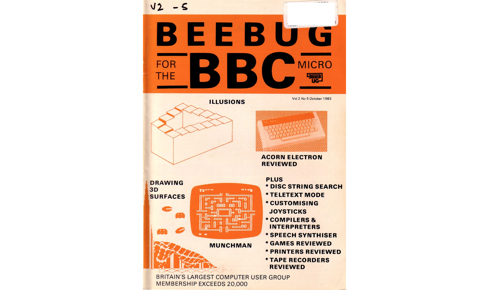

---
class: vertical-center

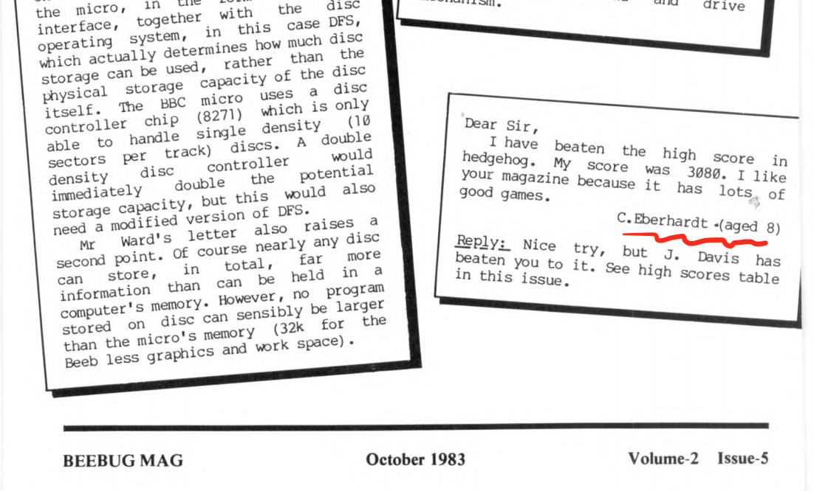

---
class: vertical-center

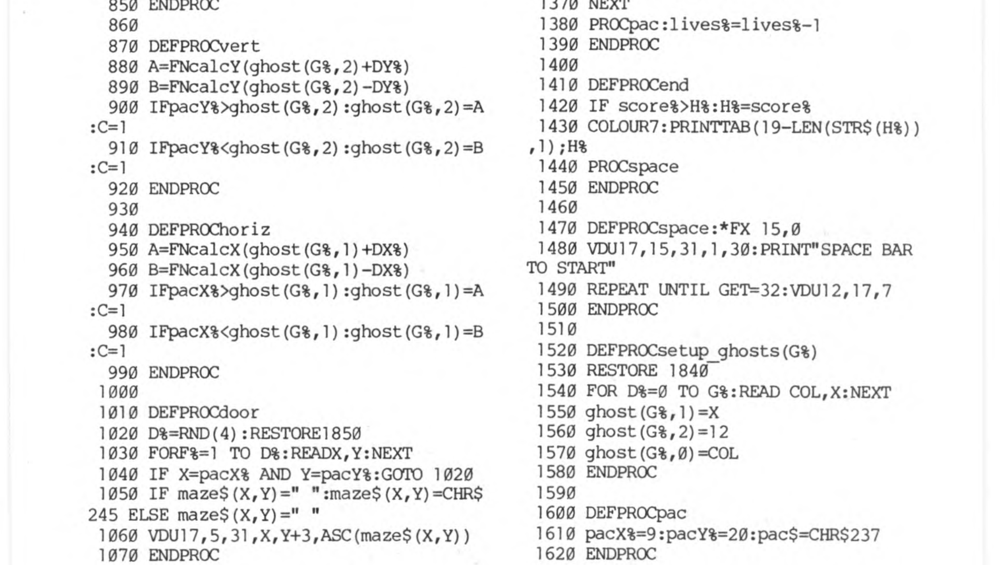

---
class: vertical-center

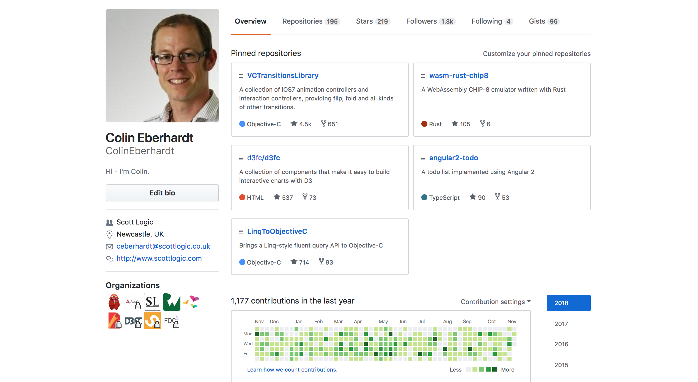

---
class: vertical-center

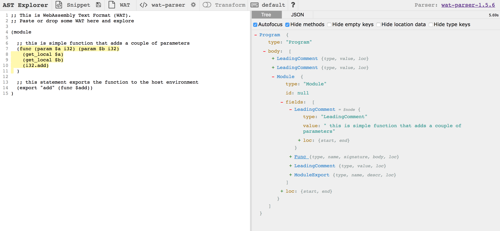

---
class: vertical-center

---
class: vertical-center

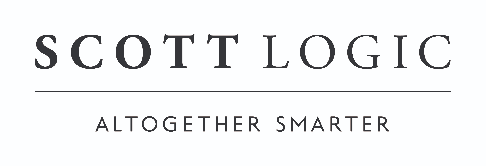

---
class: vertical-center

---
class: vertical-center

---
class: center, middle, motif9

# Tools, Bots and Automation
## for better open source projects
.color-bold-pink[• • •]
## @ColinEberhardt, Scott Logic

---
class: image-fill motif-heading heading-bottom-left
background-image: url(assets/scream.jpg)

# vulnerabilities, security, compliance, ...

---
class: image-fill 
background-image: url(assets/happy.jpg)

---
class: image-fill motif-heading heading-bottom-left
background-image: url(assets/machinery.jpg)

# The rise of automation

---

---
class: motif1,  motif-pos-bottom-right

# Why do we use DevOps? 

--
 - Reproducibility - through configuration as code, infrastructure as code
  - Reduction of defects
  - Release with confidence

--
 - Speed - through test automation, rapid deployment
  - Reduced time to market

--
 - Agility
  - Ability to try new ideas quickly, MVPs

--
 - Collaboration
  - Faster resolution of issues

---
class: image-fill motif-heading heading-bottom-left
background-image: url(assets/microservices.jpg)

# Microservices

---
class: motif9 motif-pos-bottom-right

# Does automation ensure a quality product?

--
  - *of course not!*

--
  - you hire people who are technically able

--
  - ... their behaviour is influenced by the culture

--
  - ... imparted through company and project on-boarding

--
### *but in open source, this cultural element is lost, or at least harder to build*

---
class: motif1 motif-pos-bottom-left

# Cultural challenges of open source

--
 - you're working with:

--
 - ... distributed team

--
 - ... a fluid and ever changing team

--
 - ... people with different levels of technical skills, communication skills

--
 - ... people with different needs, goals and ambitions

---
class: image-fill motif-heading heading-bottom-left
background-image: url(assets/popcorn.jpg)

# When open source goes *bad*

---

~~~javascript
function _______ (str, len, ch) {
  str = String(str);

  var i = -1;

  if (!ch && ch !== 0) ch = ' ';

  len = len - str.length;

  while (++i < len) {
    str = ch + str;
  }

  return str;
}
~~~

---

~~~javascript
function leftpad (str, len, ch) {
  str = String(str);

  var i = -1;

  if (!ch && ch !== 0) ch = ' ';

  len = len - str.length;

  while (++i < len) {
    str = ch + str;
  }

  return str;
}
~~~

--
 - Azer Koçulu withdrew 250 packages from npm, including `left-pad`
 - This package was downloaded 2.5m per month
 - Broke Babel, React, ... everything!

---

# lerna

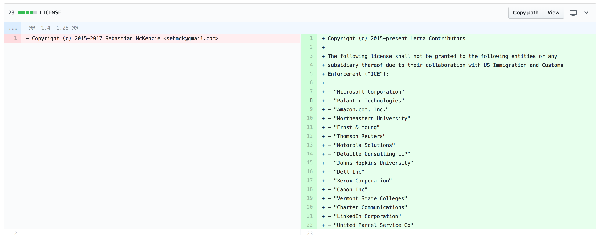

---
# eslint

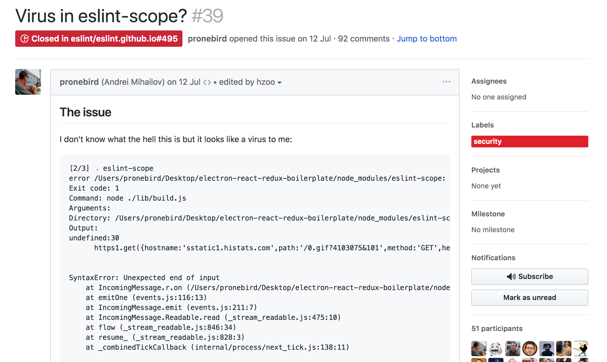

---
class: image-fill motif-heading heading-bottom-left
background-image: url(assets/community.jpeg)

# People are unpredictable!

<!-- 
In each case lessons were learnt,
security changes, automation checks, 
Code of Conduct 
-->

---
class: image-fill motif-heading heading-top-right
background-image: url(assets/tools.jpeg)

# What tools should you equip yourself with?

---
class: motif6 motif-pos-bottom-right

# Cultural challenges of open source

 - you're working with:
 - ... distributed team
 - ... a fluid and ever changing team
 - ... people with different levels of technical skills, communication skills
 - ... people with different needs, goals and ambitions

## *What do these people need?*

---
class: motif7 motif-pos-bottom-right

# As a (potential) contributor, what are my needs?

--
  - Understand the goals of the project

--
  - Rapidly clone and build locally
  <!-- lots of tools, docker, package managers -->

--
  - Test and verify my changes
  <!-- CI / unit test -->

--
  - I don't want to spend lots of time reading about code style, naming conventions, etc ...
  <!-- prettier, husky -->

--
  - I want rapid feedback on my pull requests and issues
  <!-- probot -->

---
class: motif4 motif-pos-bottom-right

# As a maintainer, what are my needs?

--
  - Baseline - the same as any other contributor

--
  - Easy to release
  <!-- CI, semantic-release -->

--
  - Communicate with, and grow, my community

--
  - Enforce my license requirements
  <!-- cla-bot -->

--
  - Manage dependencies, their licences and vulnerabilities
  <!-- GitHub, licence-checker, greenkeeper -->

---
class: image-fill motif-heading heading-bottom-left
background-image: url(assets/tools.jpeg)

# Bring on the tools!

---
class: motif2 vertical-center motif-small

# As a .color-bold-pink[contributor], I want to .color-bold-pink[easily test and verify my changes] so that .color-bold-pink[I can maximise the time I spend on feature development].

---
class: motif4 motif-pos-bottom-right

# I want to easily test and verify my changes

--
## Continuous Integration (CI)

--
 - This is your backbone 
  - Doesn't do anything by itself, it's just a trigger 

--
 - Run Unit tests (standard hygiene!)
  - gives confidence to both contributors and maintainers

---
class: motif2 motif-pos-bottom-right

# I want to rapidly clone and build locally

--
 - Use tools to manage dependencies
  - npm, crates.io, CocoaPods

--
 - Ensure your project is OS agnostic (enforce using CI)

--
 - Consider docker
 

---
class: motif2 motif-pos-bottom-right

# I don't want to spend time reading about code style, naming conventions, etc ...

---

---
class: motif2 motif-pos-bottom-right

# I don't want to spend time reading about code style, naming conventions, etc ...

--
 - Typically enforced by static analysis, and supported by editor configuration

--
  - doesn't support multiple editors
  - catches the problem late on
  - some linters have a fix mode, but not all

---

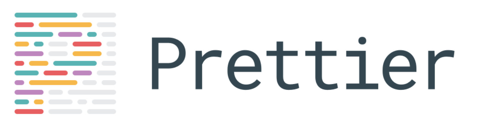

> By far the biggest reason for adopting Prettier is to stop all the on-going debates over styles.

--
 - reformats *everything* JS => AST => JS
 - opinionated, it is not intended to be configured
 - can be run in CI and editor

---

# husky - 🐶 Git hooks made easy

~~~json
{
  "husky": {
    "hooks": {
      "pre-commit": "lint-staged"
    }
  },
  "lint-staged": {
    "*.{js,json,css,md}": ["prettier --write", "git add"]
  }
}
~~~ 

---
class: motif8 motif-pos-bottom-right

# I want rapid feedback on issues

--
 - this can be quite challenging!

  - could be a hobby project that you don't have that much time for
  - or, you might be Facebook or Microsoft!

---

---

--
 - Why not use this tool to welcome new users?
 - Perhaps highlight your Code of Conduct?

---

--
 - Maybe set expectations around review timings?

---

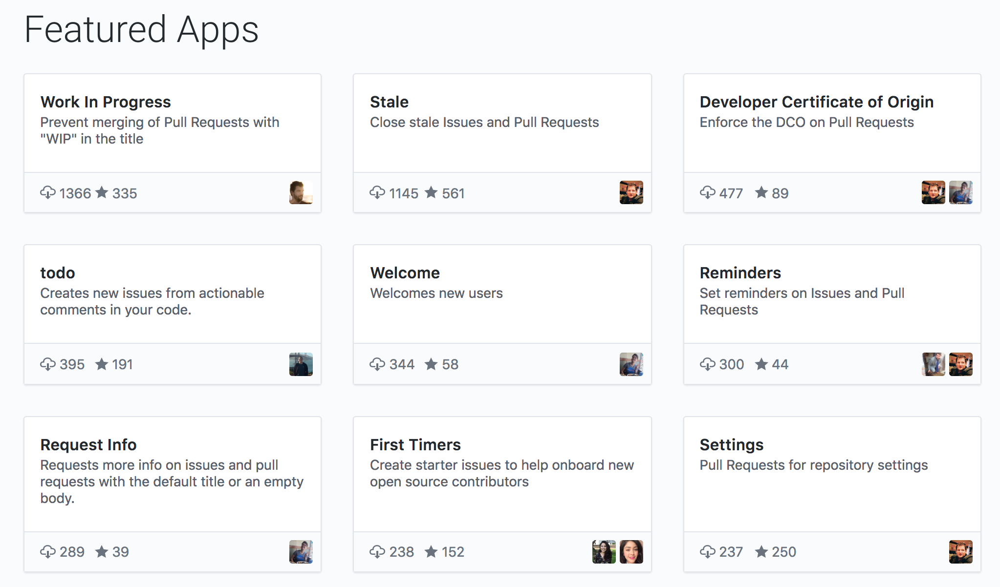

---
class: motif2 vertical-center motif-small

# As a .color-bold-pink[maintainer], I want to .color-bold-pink[easily release updates] so that .color-bold-pink[I can do better things with my time!]

---
class: motif4 motif-pos-bottom-right

# Releases are complex

 - Deployment to servers (if running as a service)
 - Releasing packages to repositories / CDNs
 - Closing issues, tagging, branch twiddling
 - Version number increments
 - Communication of changes
 - ...
 

---
class: vertical-center

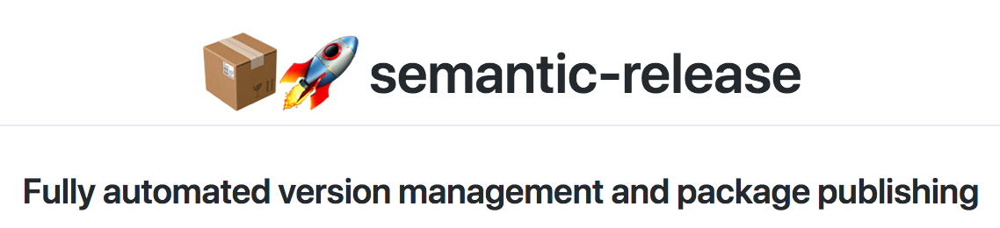

---
class: vertical-center

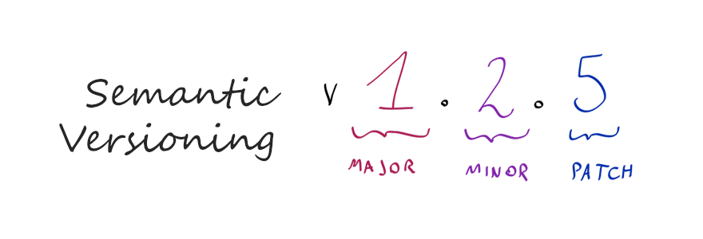

---
class: vertical-center motif4 motif-pos-bottom-right

# semantic commit messages

 
 

~~~
feat: add hat wobble
^--^  ^------------^
|     |
|     +-> Summary in present tense.
|
+-------> Type: chore, docs, feat, fix, refactor, style, or test.
~~~

---
class: motif1 motif-pos-bottom-right

# semantic release

  - Commit messages dictate the version number
  - Repo tagged
  - Release notes generated
  - New packages deployed
  - Allows Continuous Deployment of libraries / frameworks

---
class: motif8 motif-pos-bottom-right

# Manage dependencies, licences and vulnerabilities

 - Are my dependencies up to date?
 - Have there been any disclosed vulnerabilities that affect me?
 - Have I violated any of the licence terms in my dependencies?

---
class: vertical-center

### Are my dependencies up to date?

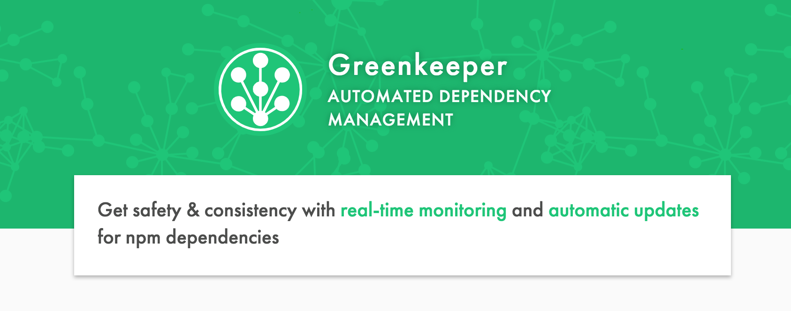

---
class: vertical-center

### Have there been any disclosed vulnerabilities that affect me?

---

### Have I violated any of the licence terms in my dependencies?

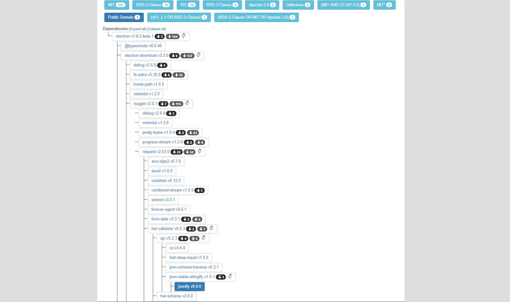

---
class: motif8 motif-pos-bottom-right

# I want enforce my licence requirements

--
  - Ensure the contributor is authorised to submit the work
  - Ensure that the project can distribute the work

--
  - CLA - Contributor Licence Agreement
  - DCO - Developer Certificate of Origin

--
  - Both require significant overhead
  - With FINOS there wasn't an existing mechanism that worked

---
class: vertical-center

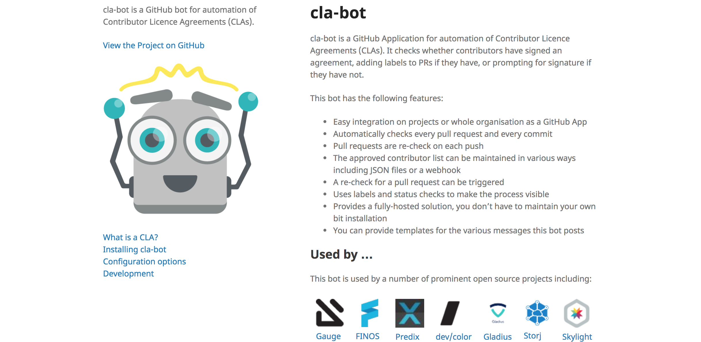

---
class: vertical-center

---
class: motif3 motif-pos-bottom-right

# Wrap up!

--
 - Use automation to make life easier for contributors and maintainers
   - there are lots of tools out there!
   - make your project more welcoming to contributors
   - reduce your maintenance overhead
   - allow you both to focus on the problem

--
 - If a suitable tool doesn't exist, build it!

--
 - Final thoughts ...
   - Open source software is built by people
   - Tools like Slack, Skype, Hangouts help build a community and create a culture

---
class: center, middle, motif9

# Tools, Bots and Automation
## for better open source projects
.color-bold-pink[• • •]
## @ColinEberhardt, Scott Logic