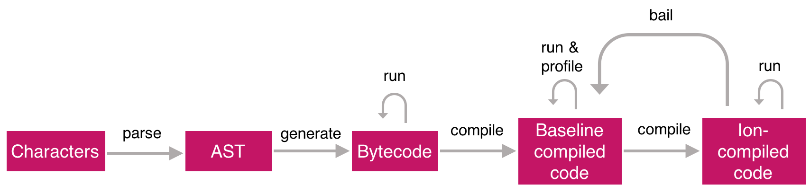
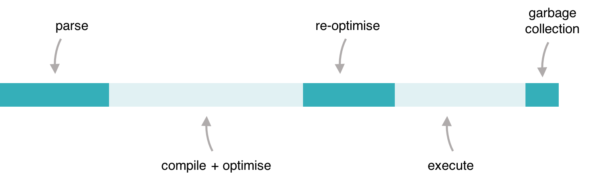
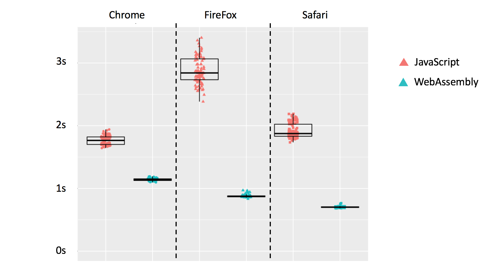

class: center, middle, motif9

# WebAssembly
## and the ~~death~~ future of JavaScript?
.color-bold-pink[• • •]
## @ColinEberhardt, Scott Logic

---
class:  image-stretch, middle, center


---
class:  image-stretch, middle, center


---
class:  image-stretch, middle, center


---
class: center, middle, motif9

# WebAssembly
## and the ~~death~~ future of JavaScript?
.color-bold-pink[• • •]
## @ColinEberhardt, Scott Logic

---
class: center, middle, motif7

# A brief history of the web

---
class: center, middle, motif7

# JavaScript

---
class: center, middle, motif7

> A rush job that was barely good enough to survive

### Brendan Eich - Full Stack Conference

---
class: center, middle, motif7

# Java Applets

---
class: center, middle, motif7

# ActiveX

---
class: center, middle, motif7

# Flash

---
class: center, middle, motif7

# Silverlight

---
class: center, middle, motif7

# Dart

---
class: center, middle, motif7

# 2018 - JavaScript (still!)

--

## ... but the way we are using it has changed

---
class: center, middle, motif7, large

# We are writing .color-bold-pink[a lot] of JavaScript

```console
$ npx create-react-app my-app
$ cd my-app
$ find . -name '*.js' | xargs wc -l | tail -1
   79905 total
```

---
class: image-fill motif-heading heading-bottom-right
background-image: url(assets/minified-js.png)

## JavaScript is the assembly language of the web

---
class: image-fill motif-heading heading-top-left
background-image: url(assets/minified-js.png)

## JavaScript isn't a very good assembly language!

---
class: image-stretch, middle, center, motif2, motif-small, motif-pos-bottom-right



---
class: image-stretch, middle, center, motif2, motif-small, motif-pos-bottom-right

## What does JavaScript execution look like today?



---
class: center, middle, motif2, motif-small, motif-pos-bottom-right

> the Web has become the most ubiquitous application platform ever, and yet by historical accident the only natively supported programming language for that platform is JavaScript!

---
class: center, middle, motif6, motif-small, motif-pos-bottom-left

# WebAssembly

> WebAssembly or wasm is a new portable, size- and load-time-efficient format suitable for compilation to the web.

---
class: image-fill motif-heading heading-bottom-right
background-image: url(assets/bits-bytes.jpg)

# asm.js

---
class: motif8, motif-pos-bottom-right

~~~c
float power(float number, int pow) {
  float res = number;
  for (int i = 0;i < pow - 1; i++) {
    res = res * number;
  }
  return res;
}
~~~

~~~
emcc power.c -O3  -s ONLY_MY_CODE=1 -s EXPORTED_FUNCTIONS="['_power']"
~~~

~~~javascript
"use asm";
function X(a, b) {
 a = +a;
 b = b | 0;
 var c = 0.0, d = 0;
 d = b + -1 | 0;
 if ((b | 0) > 1) {
  b = 0;
  c = a;
 } else return +a;
 do {
  c = c * a;
  b = b + 1 | 0;
 } while ((b | 0) != (d | 0));
 return +c;
}
~~~

---
class: image-stretch, middle, motif8, motif-pos-bottom-right


---
class: motif-heading heading-bottom-left

<video playsinline autoplay muted loop>
  <source src="/assets/unreal.mp4" type="video/mp4">
</video>

# Unreal!

---
class: center, image-stretch

# WebAssembly Roadmap

- 2015 - WebAssembly Community Group formed
- 2017 - WebAssembly MVP released
- 2018 - W3C public draft published

<br/>
<br/>


---
class: middle, image-stretch


---
class: image-fill motif-heading heading-bottom-right
background-image: url(assets/pcb.jpg)

# WebAssembly In Practice

---
class: middle, motif10, motif-pos-bottom-right

~~~c
float power(float number, int pow) {
  float res = number;
  for (int i = 0;i < pow - 1; i++) {
    res = res * number;
  }
  return res;
}
~~~

https://webassembly.studio/

---
class: middle, motif10, motif-pos-bottom-right

~~~
$ emcc add.c -O1 -s WASM=1 -s SIDE_MODULE=1 -o add.wasm

$ xxd add.wasm

00000000: 0061 736d 0100 0000 0107 0160 027d 7f01  .asm.......`.}..
00000010: 7d03 0201 0004 0401 7000 0005 0301 0001  }.......p.......
00000020: 0712 0206 6d65 6d6f 7279 0200 0570 6f77  ....memory...pow
00000030: 6572 0000 0a33 0131 0101 7d02 4020 0141  er...3.1..}.@ .A
00000040: 0248 0d00 2001 417f 6a21 0120 0021 0203  .H.. .A.j!. .!..
00000050: 4020 0220 0094 2102 2001 417f 6a22 010d  @ . ..!. .A.j"..
00000060: 000b 2002 0f0b 2000 0b                   .. ... ..
~~~

---
class: middle, small, motif10, motif-pos-bottom-right

~~~
(module
 (table 0 anyfunc)
 (memory $0 1)
 (export "memory" (memory $0))
 (export "power" (func $power))
 (func $power (param $0 f32) (param $1 i32) (result f32)
  (local $2 f32)
  (block $label$0
   (br_if $label$0
    (i32.lt_s
     (get_local $1)
     (i32.const 2)
    )
   )
   (set_local $1
    (i32.add
     (get_local $1)
     (i32.const -1)
    )
   )
   (set_local $2
    (get_local $0)
   )
   ...
   (return
    (get_local $2)
   )
  )
  (get_local $0)
 )
)
~~~

---
class: middle, motif10, motif-pos-bottom-right

~~~javascript
// read the binary into a buffer
const fs = require("fs");
const buf = fs.readFileSync("./add.wasm");

// create a wasm module
const wasmModule = new WebAssembly.Module(new Uint8Array(buf));

// construct an instance of the module
const wasmInstance = new WebAssembly.Instance(wasmModule);

// invoke the exported function
const result = wasmInstance.exports.power(2, 3)
console.log(result);
~~~

---
class: middle, motif10, motif-pos-bottom-right

~~~c
char *message = "hello wasm!";

char *getMessageRef()
{
  return message;
}
~~~

---
class: middle, motif10, motif-pos-bottom-right

~~~javascript
const { TextDecoder } = require("util");

// read the binary into a buffer
const fs = require("fs");
const buf = fs.readFileSync("./string.wasm");

// create a module and an instance
const wasmModule = new WebAssembly.Module(new Uint8Array(buf));
const wasmInstance = new WebAssembly.Instance(wasmModule);

// obtain a reference to linear and read the string
const linearMemory = wasmInstance.exports.memory;
const offset = wasmInstance.exports.getMessageRef();
const buffer = new Uint8Array(linearMemory.buffer, offset, 12);

// decode and log
const str = new TextDecoder("utf-8").decode(buffer);
console.log(str);
~~~

---
class: motif3, motif-pos-bottom-right

# WebAssembly Architecture

- A stack machine, 4 types (64 bit!), 67 instructions
- Designed to support streaming compilation
- Simple validation rules
- Exports / imports functions
- Linear memory is shared with JavaScript

---
class: image-stretch, middle, center


---
class: motif3, motif-pos-bottom-right

# WebAssembly Future

- Garbage collector
- Threads
- Host bindings
- SIMD
- Exception handling
- _and much more ..._

---
class: center, middle, motif5, motif-pos-bottom-right

# WebAssembly Language Support
## (and what people are doing with it)

---
class: motif5, motif-pos-bottom-right

# C / C++

- Built using Emscripten, based on LLVM
- Originally used to create asm.js
- Supports OpenGL, OpenAL

---
class: image-stretch


---
class: image-fill motif-heading heading-top-left
background-image: url(assets/autocad.png)

# Autocad

---
class: image-stretch


---
class: image-stretch


# vim


---
class: motif5, motif-pos-bottom-right

# Java / C&#35;

- More challenging, these languages require a GC
 
--

- Blazor, experimental project, using Mono
 - Testing interpreted mode, vs. AOT (with runtime for GC etc …)
 - Blazor is an SPA framework (Browser + Razor)

---
class: motif5, motif-pos-bottom-right

# JavaScript

- Needs a GC and isn’t statically typed


--
- “Walt is a JavaScript-like syntax for WebAssembly text format”

--
- AssemblyScript - a TypeScript to WebAssembly compiler

 - Awaiting GC before it can really become powerful

---
class: motif-heading heading-bottom-right

<video playsinline autoplay muted loop>
  <source src="/assets/force.mp4" type="video/mp4">
</video>

# D3 Force Layout
---
class: middle, motif5, motif-pos-bottom-right

~~~javascript
simulation = d3.forceSimulation()
    .force("link", d3.forceLink().id(function(d) { return d.id; }))
    .force("charge", d3.forceManyBody())
    .force("center", d3.forceCenter(width / 2, height / 2));

function ticked() {
  simulation.tick();
  link
      .attr('x1', d => d.source.x)
      .attr('y1', d => d.source.y)
      .attr('x2', d => d.target.x)
      .attr('y2', d => d.target.y);

  node
      .attr('cx', d => d.x)
      .attr('cy', d => d.y);
}

setInterval(ticked, 25);
~~~

---
class: motif5, motif-pos-bottom-right

# Rust

- Doesn’t require a GC

- Originally used Emscripten, but moved to a simpler toolchain

> We're poised to be THE language of choice for wasm.

- `wasm-bindgen`, `wasm-snip`, `wee_alloc`, ...

---
class: motif-heading heading-bottom-right

<video playsinline autoplay muted loop>
  <source src="/assets/chip8.mp4" type="video/mp4">
</video>

## CHIP8

---
class: image-stretch



---
class: motif5, motif-pos-bottom-right

# Go

 - preliminary support landed a few months ago

## Swift, Lua, Forth, Haskell, ....

## Perl, Python, ...

---
class: image-fill motif-heading heading-bottom-left
background-image: url(assets/globe.png)

### WebAssembly - it isn't Assembly, or just for the Web

---
class: image-fill motif-heading heading-bottom-right
background-image: url(assets/ethereum.jpg)

## EthereumVM


---
class: image-fill motif-heading heading-bottom-right
background-image: url(assets/crystal-ball.png)

## Crystal Ball Gazing

---
class: motif6, motif-pos-bottom-right

# 2018

- Rust, C, C++ used in production for performance critical, algorithmic tasks

--
- Webpack and improved tooling

--
- Java, C#, Typescript lots of creative experiments / POCs

--
- Native node modules

--
- WebAssembly adds reference type support

---
class: motif5, motif-pos-bottom-right

# 2019

- Garbage collection, Host bindings, SIMD, Threading, ...

--
- Java, C&#35; become production ready

--
- Another wave of mobile, desktop and server-side UI frameworks will re-target the web - _write once, run everywhere_

--
- Performance gains fail to materialise, with backlash from early adopters

--
- Heavyweight productivity tools start moving to the web (e.g. Photoshop, AutoCAD)

---
class: motif5, motif-pos-bottom-right

# 2020 - and beyond

- JavaScript will compile directly to WebAssembly, `"use wasm"`

--
- Native Android apps die-out in favour of Progressive Web Apps (PWA) running on WebAssembly

--
- Windows store moves to PWA / WASM

--
- A new DOM alternative will emerge?

--
- JavaScript's monopoly will be lost, and it's popularity will fade

--
- The ubiquity of the web extends further still

---
class: center, middle, motif9

# WebAssembly
## and the ~~death~~ future of JavaScript?
.color-bold-pink[• • •]
## @ColinEberhardt, Scott Logic

---
class: small-list, motif10, motif-pos-bottom-right

# bit.ly/colin-presents

### @ColinEberhardt

- [asm.js AOT compilation and startup performance](https://blog.mozilla.org/luke/2014/01/14/asm-js-aot-compilation-and-startup-performance/)
- [a cartoon intro to WebAssembly](https://hacks.mozilla.org/2017/02/a-cartoon-intro-to-webassembly/)
- [Mozilla and Epic Preview Unreal Engine 4 Running in Firefox](https://blog.mozilla.org/blog/2014/03/12/mozilla-and-epic-preview-unreal-engine-4-running-in-firefox/)
- [WebAssembly Studio](https://webassembly.studio/)
- [WebAssembly Specification Tracking Issues](https://github.com/WebAssembly/design/issues?q=is%3Aissue+is%3Aopen+label%3A%22%F0%9F%9B%A4+tracking%22)
- [PSPDFKit - WebAssembly a New Hope](https://pspdfkit.com/blog/2017/webassembly-a-new-hope/)
- [The Future of AutoCAD](http://through-the-interface.typepad.com/through_the_interface/2018/03/the-future-of-autocad.html)
- [Migrating D3 Force Layout to WebAssembly](https://blog.scottlogic.com/2017/10/30/migrating-d3-force-layout-to-webassembly.html)
- [Writing a CHIP-8 emulator with Rust and WebAssembly](https://blog.scottlogic.com/2017/12/13/chip8-emulator-webassembly-rust.html)
- [Oxidizing SourceMaps with Rust and Wasm](https://hacks.mozilla.org/2018/01/oxidizing-source-maps-with-rust-and-webassembly/)
- [Transpiling WebAssembly to support Multi Return Values](https://blog.scottlogic.com/2018/05/29/transpiling-webassembly.html)