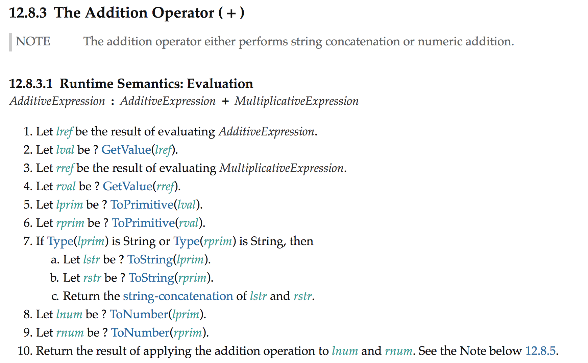

layout: true
class: middle

---
class: center, middle, chapter

# WebAssembly
## The future of web development?
## Colin Eberhardt


---
class: center, middle, chapter

# A brief history of the web

---
class: center, middle

# 1995 - JavaScript
## (created in 10 days in May 1995, by Brendan Eich)

---
class: center, middle

# Java Applets

---
class: center, middle

# ActiveX

---
class: center, middle

# Flash

---
class: center, middle

# Silverlight

---
class: center, middle

# Dart


---
class: center, middle

# 2017 - JavaScript (still!)

---
class: center, middle

# 2017, 28th Feb - WebAssembly

<!-- https://lists.w3.org/Archives/Public/public-webassembly/2017Feb/0002.html -->

---
class: center, middle, chapter

# Why do we need WebAssembly?

---
class:image

> JavaScript is an assembly language ... the browser can execute it, but no human should really care what’s there. -&nbsp;Erik&nbsp;Meijer

<!--
this was controversial then, but now is an undeniable reality
-->


---
class: image, middle


JavaScript is not a very good assembly language!

<!--

https://blog.mozilla.org/luke/2014/01/14/asm-js-aot-compilation-and-startup-performance/

- The first JavaScript engine, SpiderMonkey, was an interpreter
- Interpreters operate line-by-line, translating on-the-fly
- Compilers translate the entire application to the target machine
 - Performance can be enhanced via static analysis

- Around 2008, JIT compilers were added, giving some of the advantages of a compiler
- A JIT can selectively compile parts of the app, 'hot code' can be further optimised

-->

---
class: image



https://tc39.github.io/ecma262/#sec-addition-operator-plus


---
class: image, middle

What does JavaScript execution look like today?


... via Lin Clark's [cartoon intro to WebAssembly](https://hacks.mozilla.org/2017/02/a-cartoon-intro-to-webassembly/)

---
class: center, middle, chapter

# asm.js - WebAssembly beginnings

---
class: middle

# What is asm.js?

- A radical idea from Mozilla (2014)
 - Represent memory as a JavaScript array
 - Define a strict subset of JavaScript that operates on this array
 - Creating a 'virtual CPU'

---

~~~c
float power(float number, int pow) {
  float res = number;
  for (int i = 0;i < pow - 1; i++) {
    res = res * number;
  }
  return res;
}
~~~

~~~
emcc power.c -O3  -s ONLY_MY_CODE=1 -s EXPORTED_FUNCTIONS="['_power']"
~~~

~~~javascript
"use asm";
function X(a, b) {
 a = +a;
 b = b | 0;
 var c = 0.0, d = 0;
 d = b + -1 | 0;
 if ((b | 0) > 1) {
  b = 0;
  c = a;
 } else return +a;
 do {
  c = c * a;
  b = b + 1 | 0;
 } while ((b | 0) != (d | 0));
 return +c;
}
~~~

---
class:image

asm.js optimised execution


---
class:image

The limits of asm.js


... solves the compile / optimisation / garbage collection issues, but not the parse issue

---
class: center, middle, chapter

# 2015 - WebAssembly!

Started as a collaboration between Google, Microsoft, Mozilla and others
<!-- https://brendaneich.com/2015/06/from-asm-js-to-webassembly/ -->

---
class: center

# Building WebAssembly

<br/>

```
  clang        llc (Fastcomp)   BinaryEn (asm2wasm)
    |                  |            |
c  ==>  LLVM bitcode  ==>  asmjs   ==>  wasm
```

<br/>


or WasmFiddle!

https://wasdk.github.io/WasmFiddle//?yi3bz

---
class: image

# WebAssembly Mandelbrot


---
class: image

# Performance?


👉 d3fc.io 🎉

---
# What is WebAssembly good for?

- Games
- 3D graphics
- Porting existing C / C++ codebases
- In the future, other languages will be supported
 - C# support is under way
- Productivity tools, video editing
- But if you are not doing any of the above, what's the point?

---
class: chapter, center, middle

# AssemblyScript

---

~~~c
float power(float number, int pow) {
  float res = number;
  for (int i = 0;i < pow - 1; i++) {
    res *= number;
  }
  return res;
}
~~~

👇👇 AssemblyScript 👇👇

~~~javascript
const power = (number: f64, pow: i32) {
  let res: f64 = number;
  for (let i: i32 = 0;i < pow - 1; i++) {
    // bug *= doesn't work properly!
    res = res * number;
  }
  return res;
}
~~~

(speak the unspoken types!)

---
class:image


... there *is* a point to WebAssembly!

---
class: center

# ... finish on a cool demo ...

<!-- https://bl.ocks.org/ColinEberhardt/6ceb7ca74aabac9c8534d7120d31b382 -->


---
class: center

# Post-MVP WebAssembly

http://webassembly.org/docs/future-features/
https://wasmdash.appspot.com/

---
class: center, middle, chapter

# WebAssembly
## The future of web development?
## Colin Eberhardt
